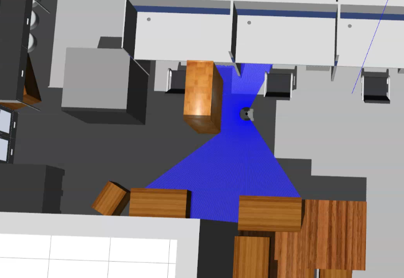
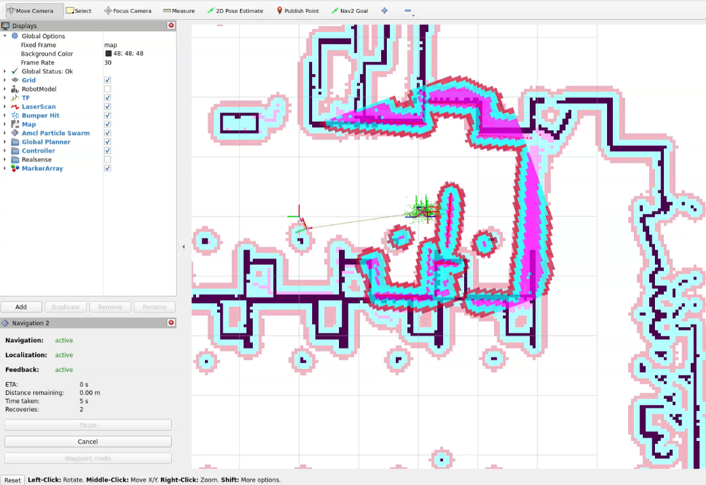
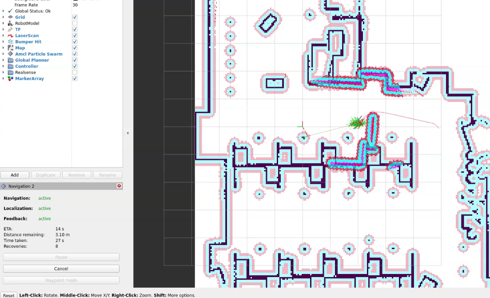
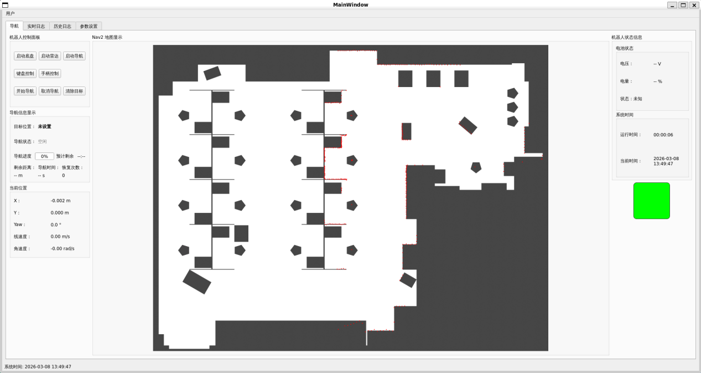
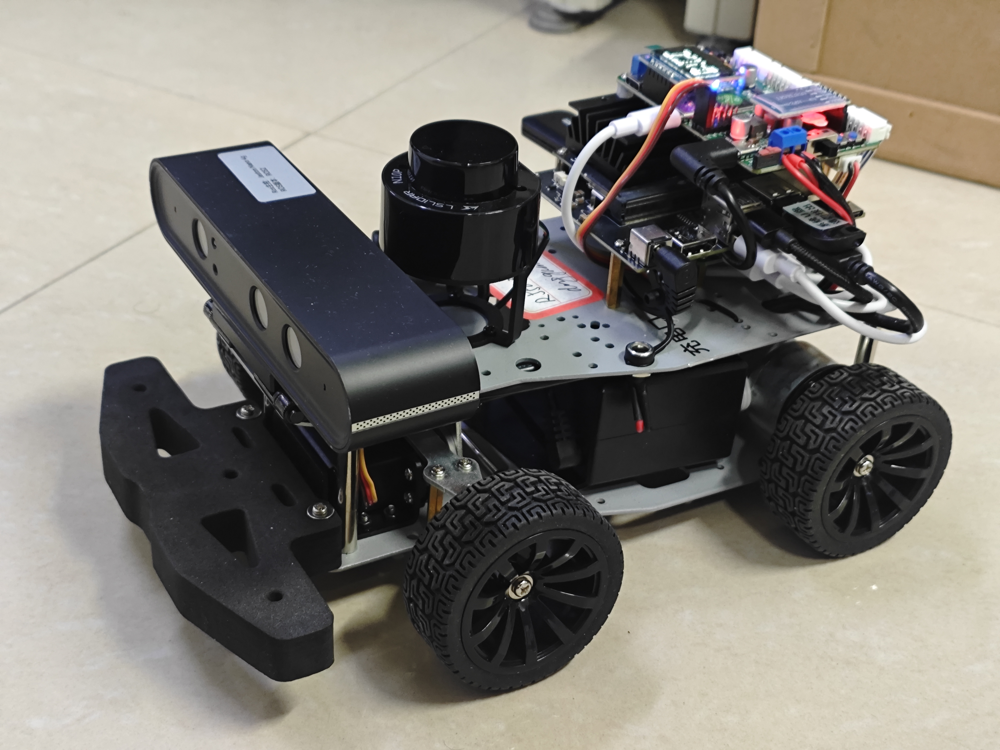
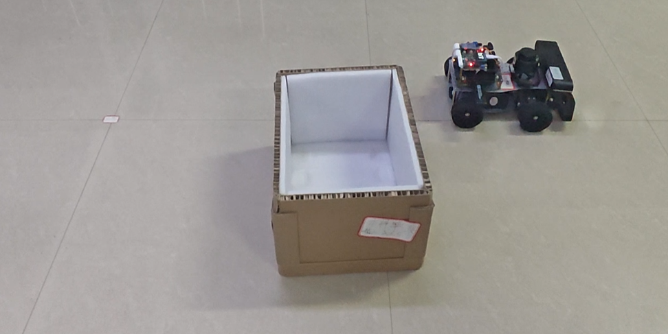

# ROS2 Intelligent Navigation & Recovery System

[](https://docs.ros.org/)
[](https://en.cppreference.com/)
[](https://doc.qt.io/qt-5/)
[](LICENSE)

ROS2-based robot navigation system featuring a **3-tier intelligent recovery strategy**, Behavior Tree orchestration, and a multi-threaded Qt5 HMI. Developed as an undergraduate capstone project, deployed on both **Gazebo simulation** and **Wheeltec real-robot platforms** (30+ chassis models).

## Highlights

- **3-Tier Recovery Algorithm** — Behavior Tree-driven stuck/collision/unknown-obstacle classification with progressive fallback
- **Multi-Threaded HMI** — Qt5 interface with dedicated threads for robot state, system monitoring, and log collection
- **Dual-Platform** — Simulation (Gazebo, Ackermann + Differential) and real-robot (Wheeltec 30+ chassis variants)
- **Custom BT Nodes** — `IsFootprintInCollision`, `PublishInterventionStatus`, `MoveForward`, `WaitAtWaypoint`

## Architecture

```
custom_bt_plugins ──► robot_navigation2 ──► robo_nav2_hmi
                           │
                    gazebo_simulation
```

| Layer | Package | Role |
|-------|---------|------|
| Algorithms | `custom_bt_plugins` | Custom BehaviorTree nodes for recovery detection |
| Navigation Core | `robot_navigation2` | Waypoint follower + 3-tier recovery + Action server |
| Simulation | `gazebo_simulation` | Gazebo worlds with Ackermann/Differential robot models |
| HMI | `robo_nav2_hmi` | Qt5 dashboard, log viewer, user auth, Nav2 parameter control |
| Real-Robot (variant) | `galictic*/` | Wheeltec adaptation with 30+ chassis parameter presets |

## Recovery Strategy

On `FollowPath` failure, the Behavior Tree evaluates three branches:

| Branch | Condition | Recovery Actions |
|--------|-----------|-----------------|
| **Stuck** | Negative acceleration detected | `BackUp` 0.25–0.40 m |
| **Collision** | Footprint overlaps costmap obstacle | `ClearCostmap` → `BackUp` 0.15 m → `ComputePathToPose` → `DriveOnHeading` 0.3 m fallback |
| **Unknown Obstacle** | No collision, robot still blocked | `BackUp` → `DriveOnHeading` (no costmap clearing) |

**Planning failure escalation** (4 levels): Wait Probe → Directional Move → Clear Local Costmap → Clear Global Costmap → **Manual Intervention Alert**

<p align="center">
  
  
  
</p>

## HMI (Qt5)

<p align="center">
  
</p>

| Thread | Purpose |
|--------|---------|
| `RobotStatusThread` | Real-time pose, velocity, sensor data |
| `SystemMonitorThread` | CPU, memory, ROS graph health |
| `LogThread` | `/rosout` subscription → SQLite persistence |
| `NavigationActionThread` | WaypointFollower Action client |
| `Nav2ParameterThread` | Dynamic Nav2 parameter read/write |

## Real-Robot Deployment

<p align="center">
  
  
</p>

## Directory Structure

```
├── custom_bt_plugins/       # BT plugins (collision detection, intervention)
├── robot_navigation2/       # Navigation core + recovery algorithms
│   ├── action/              #   Custom FollowWaypointsWithWait action
│   ├── behavior_trees/      #   BT XML (ackermann + differential)
│   ├── config/              #   Nav2 parameters, waypoints, RViz
│   ├── plugins/             #   WaitAtWaypoint plugin
│   ├── src/                 #   Waypoint server, runner, initpose, log monitor
│   ├── launch/              #   Navigation launch files
│   ├── maps/                #   PGM maps
│   └── test/                #   Unit tests
├── robo_nav2_hmi/           # Qt5 HMI (72 source files)
├── gazebo_simulation/       # Gazebo worlds + URDF robot models
├── galictic版本恢复算法功能包/ # Real-robot adaptation variant
│   ├── custom_bt_plugins/   #   BT plugins (adds MoveForward)
│   └── wheeltec_robot_nav2/ #   Navigation for 30+ Wheeltec chassis
└── docs/                    # Architecture diagrams + images
```

## Build

```bash
# Requires ROS2 Humble/Jazzy workspace
colcon build --packages-select custom_bt_plugins robot_navigation2 robo_nav2_hmi
colcon build --packages-select gazebo_simulation
```

## Test

```bash
colcon test --packages-select robot_navigation2 --event-handlers console_direct+
```

## License

Apache 2.0
