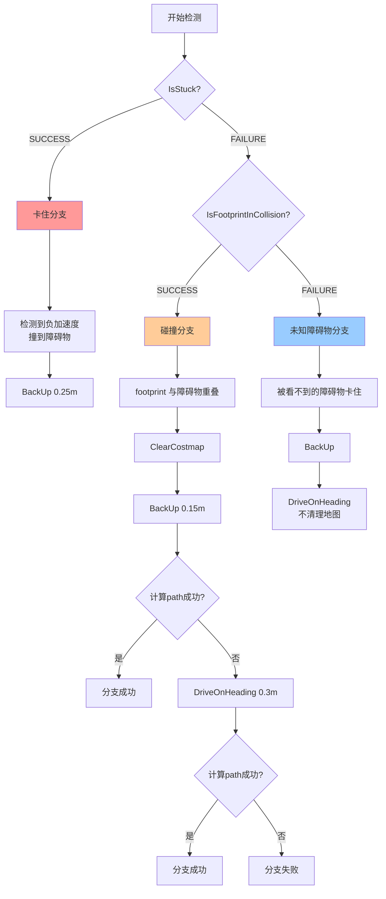

# 行为树逻辑

## 表格形式

| 条件 | 含义 | 分支 | 恢复动作 |
|------|------|------|----------|
| IsStuck=SUCCESS | 检测到负加速度，撞到障碍物 | 卡住分支 | BackUp（只后退） |
| IsStuck=FAILURE 且 IsFootprintInCollision=SUCCESS | footprint 与障碍物重叠 | 碰撞分支 | ClearCostmap → BackUp 0.15m → 尝试计算path → (失败则) DriveOnHeading 0.3m → 尝试计算path |
| IsStuck=FAILURE 且 IsFootprintInCollision=FAILURE | 被看不到的障碍物卡住 | 未知障碍物分支 | BackUp → DriveOnHeading（不清理地图） |

## 流程图形式

